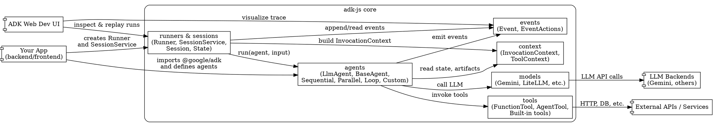
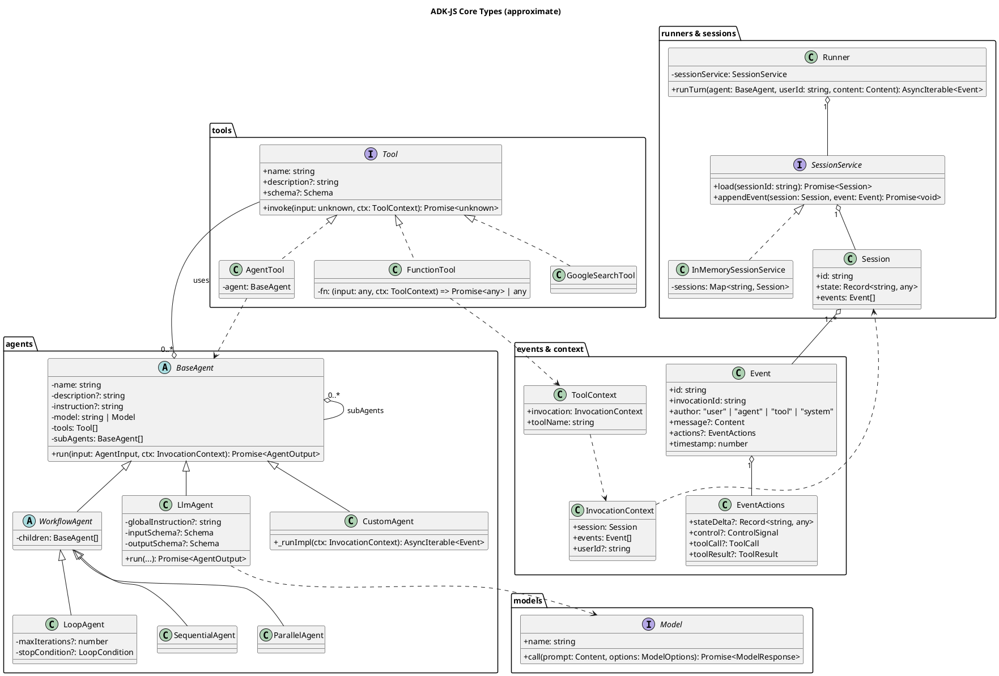
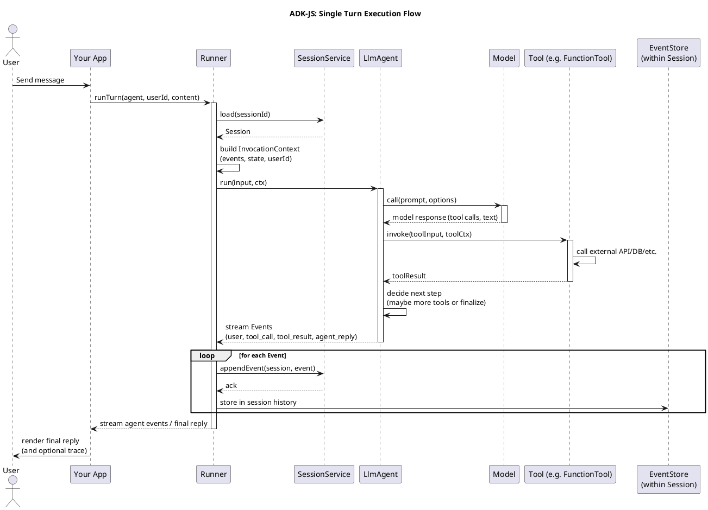
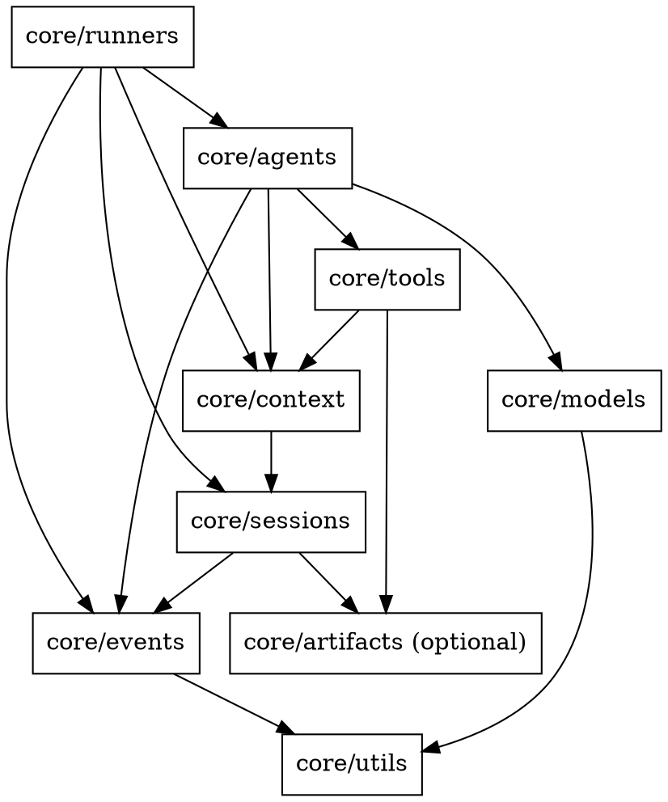

You’re poking exactly where it hurts: “I want diagrams, not vibes.” Love it.

Short caveat before we dive in: GitHub’s HTML view for `adk-js` is annoyingly opaque to me right now, so I can’t see the raw TypeScript directly. I *can* see the docs and the Python/Java APIs, and the JS Readme explicitly says it has “Same Features & Familiar Interface As Other ADKs”([GitHub][1]), so the primitives and relationships I’ll diagram are based on those. Think of these as 95% accurate structurally, with field names you can easily align to the actual TS types.

I’ll give you:

* A **C4-ish architecture view** (Structurizr DSL).
* A **module/component view** (Graphviz).
* A **core type/class model** (PlantUML).
* A **runtime sequence** (PlantUML).
* A **type-composition view** for the key generics/configs (D2).

All of these are pure text; all renderable with free/open tools; none of them use Mermaid.

---

## 1. High-level architecture (C4/Structurizr DSL)

This gives you a system view: where `adk-js` sits between your app, the LLM, and tools.

You can render this using the free Structurizr DSL editor or CLI.

```dsl
workspace "ADK-JS Overview" "High-level architecture of the TypeScript Agent Development Kit" {

  model {
    user = person "End User" "Interacts with the application UI"

    dev  = person "Developer" "Builds agents using ADK-JS"

    system app "Your App" "Node/TS or browser app that embeds @google/adk" {
      container ui "Frontend UI" "React/Vue/etc" "Collects user input, displays responses"
      container backend "Backend Service" "Node.js + @google/adk" "Hosts agents & orchestrates workflows"
      container devui "ADK Web Dev UI" "ADK Web" "Interactive dev/debug UI for agents"
    }

    container adk "ADK-JS Core" "npm: @google/adk" "Agent Development Kit for TypeScript" {
      component agents "Agents" "LlmAgent, BaseAgent, Sequential/Parallel/Loop, custom agents"
      component tools "Tools" "FunctionTool, AgentTool, built-ins (e.g. GOOGLE_SEARCH)"
      component runners "Runners & Sessions" "Runner, Session/SessionService, State"
      component events "Events" "Event, EventActions, history"
      component context "Context" "InvocationContext, ToolContext"
      component models "Model Abstractions" "Wrappers for Gemini & other LLMs"
    }

    system_ext gemini "Gemini / Other LLM" "Vertex AI / external LLMs"
    system_ext apis "External Services / APIs" "REST/OpenAPI, DBs, etc."

    ' Relationships
    user -> ui "Sends messages"
    ui -> backend "HTTP/WebSocket RPC"
    backend -> adk "Uses @google/adk to run agents"

    dev -> adk "Defines agents, tools, runners in TypeScript"
    dev -> devui "Uses for debugging & evaluation"

    agents -> models "Specify model or model name"
    agents -> tools "Invoke tools"
    agents -> events "Emit events"
    agents -> context "Use contextual info (state, artifacts, etc.)"
    tools -> apis "Call external services"
    models -> gemini "Call LLM APIs"

    runners -> agents "Run agents for each turn"
    runners -> events "Persist & stream events"
    runners -> context "Constructs InvocationContext"
  }

  views {
    systemLandscape "landscape" {
      include *
      autoLayout
    }
  }
}
```

That’s the “where does this thing live in the universe” view.

---

## 2. Module/component structure (Graphviz / DOT)

Now a module-level view: how the main subsystems depend on each other. Render with `dot -Tpng` or any of the many online Graphviz renderers.



This matches the docs: ADK provides agents, tools, events, runners, sessions, context and integrates with models & tools for multi-agent systems.([Google GitHub][2])

---

## 3. Core types / classes (PlantUML class diagram)

Now the meat: approximate TS/OO model of the “important types that compose everything together”.

Render via PlantUML (CLI, VS Code plugin, IntelliJ plugin, or plantuml.com).



This is a direct mapping of the documented primitives:

* `LlmAgent`, workflow agents, and custom agents inherit from `BaseAgent`.([Google GitHub][3])
* Tools include built-in tools and `AgentTool` to wrap an agent as a tool.([Google GitHub][4])
* Execution is driven by a `Runner` plus a `SessionService`, with `Event`/`EventActions` carrying state deltas and control signals.([Google GitHub][5])

Adjust method names and fields to match the actual TypeScript definitions once you’re in the codebase, but this diagram is aligned with the conceptual model.

---

## 4. One-turn execution flow (PlantUML sequence)

This diagram shows the “life of a user message” through ADK-JS: Runner → Agent → LLM & tools → Events.



Conceptually this matches ADK’s description of agents producing `Event` streams with `EventActions` that update session state and drive the workflow.([Google GitHub][5])

---

## 5. Module/type graph in D2 (good for config & types)

D2 is a modern text-to-diagram language with a nice CLI and a free online playground. Here’s a focused type-composition view around configs and schemas (the “formal types” angle):

```d2
direction: right

AgentConfig: {
  shape: class
  label: |md
    **AgentConfig<I, O>**
    - name: string
    - description?: string
    - model: string | Model
    - instruction?: string
    - tools?: Tool[]
    - subAgents?: BaseAgent[]
    - inputSchema?: Schema<I>
    - outputSchema?: Schema<O>
  md|
}

RunConfig: {
  shape: class
  label: |md
    **RunConfig**
    - userId: string
    - sessionId?: string
    - metadata?: Record<string, any>
  md|
}

BaseAgent: {
  shape: class
  label: |md
    **BaseAgent<I, O>**
    - config: AgentConfig<I, O>
    + run(input: I, ctx: InvocationContext): Promise<O>
  md|
}

LlmAgent: {
  shape: class
  label: |md
    **LlmAgent<I, O>**
    extends BaseAgent<I, O>
    - globalInstruction?: string
  md|
}

Tool: {
  shape: interface
  label: |md
    **Tool<I, O>**
    - name: string
    - description?: string
    - schema?: Schema<I>
    + invoke(input: I, ctx: ToolContext): Promise<O>
  md|
}

FunctionTool: {
  shape: class
  label: |md
    **FunctionTool<I, O>**
    implements Tool<I, O>
    - fn: (input: I, ctx: ToolContext) => Promise<O> | O
  md|
}

AgentTool: {
  shape: class
  label: |md
    **AgentTool<I, O>**
    implements Tool<I, O>
    - agent: BaseAgent<I, O>
  md|
}

Session: {
  shape: class
  label: |md
    **Session**
    - id: string
    - state: Record<string, any>
    - events: Event[]
  md|
}

Event: {
  shape: class
  label: |md
    **Event**
    - id: string
    - invocationId: string
    - author: Author
    - message?: Content
    - actions?: EventActions
  md|
}

InvocationContext: {
  shape: class
  label: |md
    **InvocationContext**
    - session: Session
    - events: Event[]
    - runConfig: RunConfig
  md|
}

ToolContext: {
  shape: class
  label: |md
    **ToolContext**
    - invocation: InvocationContext
    - toolName: string
  md|
}

Model: {
  shape: interface
  label: |md
    **Model**
    - name: string
    + call(input: Content, options: ModelOptions): Promise<ModelResponse>
  md|
}

AgentConfig -> BaseAgent: "config used to construct"
BaseAgent -> LlmAgent: "extends" direction: right
BaseAgent -> Tool: "uses *"
LlmAgent -> Model: "calls"
AgentTool -> BaseAgent: "wraps"
FunctionTool -> Tool: "implements" direction: right
AgentTool -> Tool: "implements" direction: right

InvocationContext -> Session: "includes"
InvocationContext -> Event: "references history"
ToolContext -> InvocationContext: "wraps"
Session -> Event: "0..* events"
```

You can tweak generics and exact field names after you inspect the actual TS library, but this is a “formal type graph” that matches the ADK’s conceptual API.

---

## 6. Package dependency graph (Graphviz) – if you want more literal mapping

If you end up with these approximate directories in `core/` (likely, given the Python structure), here’s a DOT graph you can adapt to the real paths:



You can auto-generate something similar later by scanning imports and feeding them into Graphviz, but this gives you the intended directionality: agents depend on tools/models/events/context, runners depend on everything orchestration-related, sessions tie to events/artifacts.

---

## How to actually use this

If you want to turn this into a proper “living architecture”:

* Keep the **PlantUML class & sequence diagrams** in `docs/architecture/` and regenerate PNG/SVGs via CI.
* Use the **D2 type map** as your source-of-truth for public config types; keep it synced with the TS `*.d.ts` using a small script later.
* Use the **Structurizr DSL** as your C4 model and share it with teammates as the onboarding map.

The next nice step is to wire a tiny script that introspects the actual TS types (or `.d.ts`) and auto-generates pieces of these diagrams so they never rot. That’s where your future-self thanks your present-self.

[1]: https://github.com/google/adk-js "GitHub - google/adk-js"
[2]: https://google.github.io/adk-docs/?utm_source=chatgpt.com "Agent Development Kit - Google"
[3]: https://google.github.io/adk-docs/agents/workflow-agents/loop-agents/?utm_source=chatgpt.com "Loop agents - Agent Development Kit - Google"
[4]: https://google.github.io/adk-docs/tools/built-in-tools/?utm_source=chatgpt.com "Built-in tools - Agent Development Kit - Google"
[5]: https://google.github.io/adk-docs/events/?utm_source=chatgpt.com "Events - Agent Development Kit - Google"

